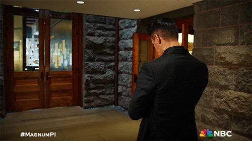

# ⚜ Bem vindo(a) ao meu github!

😎Sou amante de Tecnologia, sou fascinado por gamificação, atualmente
sou professor de informática e entrei de cabeça do mundo DEV. "Conhecimento é poder". 

- 🦅 Formado em Administração
- 🧠Pós Graduação em neurociêcia
- 👾Tec. Redes de Computadores
- 📓 Esp. Produção de Midias Digitais
- 👩‍💻 Aprendendo front-end
- 🎨 Estudando UI e UX Design

<h2>O que estou desenvolvendo</h2>

Na Jedais Tec, oferecemos cursos de informática, programação e robótica de forma gamificada. Em breve, incluiremos Inteligência Artificial e empreendedorismo digital em nossos módulos.
 

  &nbsp;
  &nbsp;
  &nbsp;
  &nbsp;

---

    
    
    

